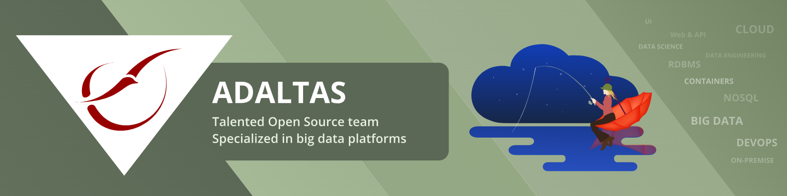

We are a diverse and data-focused company with a common pursuit of providing top-class, end-to-end data solutions for our clients.

Our team in Paris is united by a passion for improving the digital experience and the belief that with the right tools, we can help any organization generate values from their data.

We work on the largest and most critical data infrastructures accross all economical sectors including government, banking, telecommunications, utilities...

Our skills encompass data engineering, data science, infrastructure engineering, and solution architecture.

Opportunities include working on-site with our customers and partners, being an active contributor to the open source community, teaching in universities, and joining our expert support team.

## Personal development

Team members join a professional learning community with opportunities to grow, learn, explore, and collaborate.

Twice a year the entire team travels for an international event or a one-week self-organized conference.

Volunteers can share their skills in master programs to teach DevOps, big data architecture, and data engineering.

## Open source

We contribute to the [open source community](https://www.adaltas.com/en/opensource/). Adaltas is an open company. Our commitment is built on a foundation of open source, open collaboration, open standards, and open education.

Lately, we have been working heavily on [TDP](https://github.com/TOSIT-FR/TDP), the 100% open source big data platform. [Alliage](https://www.alliage.io) provides support and professional services on TDP. We are looking for candidates to join the team and provide contributions.

## Current openings

We are always excited to meet great candidates. Feel free to [contact us](https://www.adaltas.com/en/careers/) to schedule a call. [New positions](https://www.adaltas.com/en/careers/) open almost daily, don’t hesitate to apply.